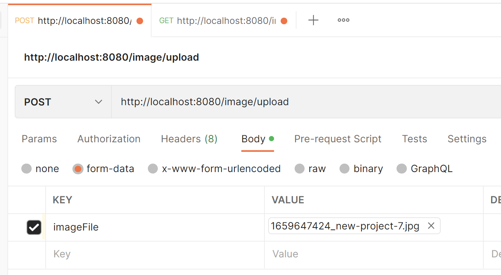

# Table of Contents:

[AOP](#AOP) \
[Batch](#Batch) \
[CSV Excel file reader](#CsvExcelFileReader) \
[Dynamic JSON request](#DynamicJsonRequest) \
[EXE App](#ExeApp) \
[Filters and Interceptors](#FiltersAndInterceptors) \
[Graceful shutdown](#GracefulShutdown) \
[Image Upload & Download](#ImageUploadAndDownload) \
[Lombok](#Lombok) \
[Multipart Request & RequestBody](#MultipartRequestAndRequestBody) \
[Parquet File](#ParquetFile) \
[PDF Generation](#PdfGeneration) \
[POJO to XSD](#PojoToXsd) \
[Reflection](#Reflection) \
[Scheduler](#Scheduler) \
[Script Execution from Java](#ScriptExecutionFromJava) \
[Send Mail](#SendMail) \
[Video Stream](#VideoStream) \
[Video Upload & Download](#VideoUploadAndDownload) \
[Voice Command](#VoiceCommand) \
[XSD to POJO](#XsdToPojo)

## AOP

## Batch

[Official Doc](https://docs.spring.io/spring-batch/docs/current/reference/html/index.html)
https://hevodata.com/learn/batch-processing-in-spring-boot/

[Issue 1](https://stackoverflow.com/questions/55381505/preparedstatementcallback-bad-sql-grammar-select-job-instance-id-job-name-fro)
[Issue 2](https://stackoverflow.com/questions/47085330/prevent-spring-batch-automatic-job-trigger-after-context-creation-without-spring)
[Issue 3](https://stackoverflow.com/questions/48424367/allowing-core-thread-timeout-with-scheduledthreadpoolexecutor)

## CsvExcelFileReader

## DynamicJsonRequest

## ExeApp

## FiltersAndInterceptors

## GracefulShutdown

## ImageUploadAndDownload

## Lombok

### Tutorial Link:

[Link](https://www.sitepoint.com/beyond-pojos-ten-ways-reduce-boilerplate-lombok/)

## MultipartRequestAndRequestBody

## ParquetFile

## PdfGeneration

## PojoToXsd

## Reflection

## Scheduler

## ScriptExecutionFromJava

## SendMail

## VideoStream

## VideoUploadAndDownload

2 MB limit

````
ALTER TABLE IMAGE_MODEL ALTER COLUMN PIC_BYTE VARCHAR(2097152);

Delete FROM IMAGE_MODEL; 
SELECT * FROM IMAGE_MODEL;

````

[Tutorial Link 1](https://github.com/janzyka/blobs-jpa) (Worked) <br>
[Tutorial Link 2](https://dzone.com/articles/upload-and-retrieve-filesimages-using-spring-boot)

### POST Request:



### GET Request:

http://localhost:8080/image/download/image_name.format {Format should be specified else 404 will be
thrown}

## VoiceCommand

## XsdToPojo

### JAXB

- [Github](https://github.com/IntershopCommunicationsAG/jaxb-gradle-plugin[GitHub)
- Easy to implement.

### XJC

- [Github](https://github.com/bjornvester/xjc-gradle-plugin[GitHub)
- Gives more control.
