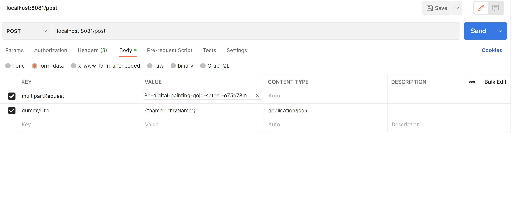

= Multipart Request and RequestBody at the same time in a Post request.
:toc:

== Description

- We can not read Multipart File and RequestBody at the same time in a post request.

- In order to achieve it, we've to use @RequestPart annotation instead of @RequestParam and @RequestBody.

- Also, there is a small change in Postman that we've to make to run the test.

As shown above, we've to add content type as "application/json" for body part.
For Multipart request we can skip content type.

NOTE: Content Type is hidden by default.
To enable it, click on 3 dots next to Description tab.
